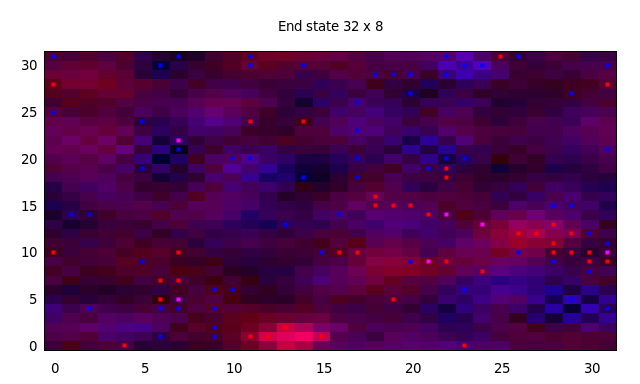

# AgentBasedMCMC

This is an implementation of the algorithm described in the paper [/doc/ABMCMC.pdf](./doc/ABMCMC.pdf) which allows Markov chain Monte Carlo sampling from the posterior distribution of an agent-based model given agent behaviour, a prior distribution over the boundary conditions and a set of observations.

The code assumes that the model trajectory is act-Fermionic. See the paper for more details.

## Installation
The code uses the [boost](https://www.boost.org/) libraries and the [gnuplot](http://www.gnuplot.info/) executable, so make sure these are installed. On Ubuntu this can be done with the command

``sudo apt-get install libboost-filesystem-dev libboost-serialization1.65-dev libboost-iostreams1.65.1 gnuplot``

changing the version numbers as appropriate.

To build the executable type ``make`` in the ``src/build`` directory. This should make an executable called ``abmcmc``. Uncomment the various sections in ``main.cpp`` in order to re-calculate the results, generate timings or test the software.
